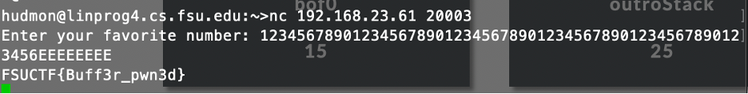
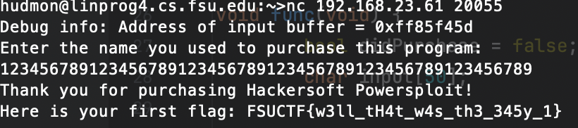
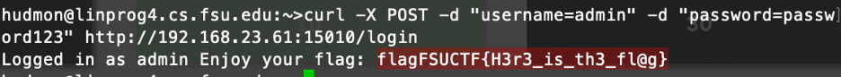
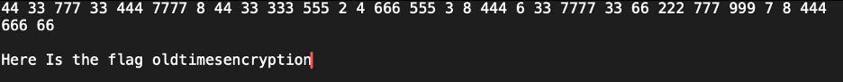
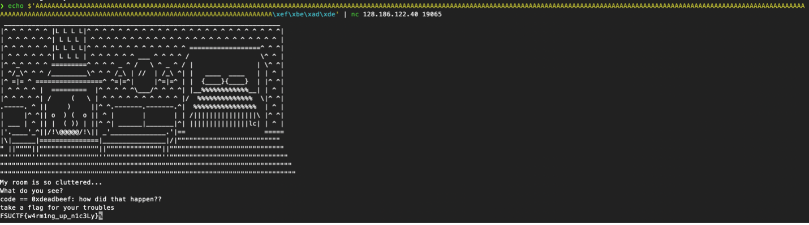

# CTF
A CTF competition I participated in through Florida State University
Dirtball

To change the code variable you need to overflow the buffer by outputting 260 A’s and then using \x to write the value in hex to the variable. The hex numbers are put in backwards order so they can go on the stack correctly to change the value.

Nokia 3301

The numbers correspond to a keypad on a flip phone, so when you press numbers multiple times they equal different characters. Doing this method yields the flag.

SQLi

To get this flag you need to send a post request to the login server as admin which logs you in as admin and gives the flag.

IntroStack

If you overflow the buffer for this program you can overwrite the flag that gives you the completion flag. Once you overwrite this value the program will give you the flag.

Buffer Overflow

For this buffer overflow if you overwrite the last few bytes with the character E it sets the variable to the correct value which gives you the flag.

## Extracted Images

